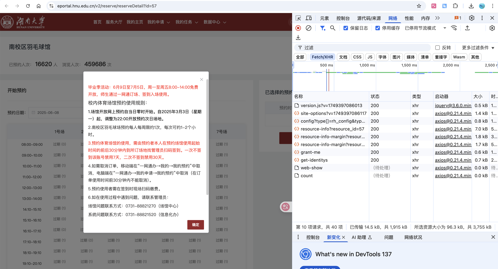
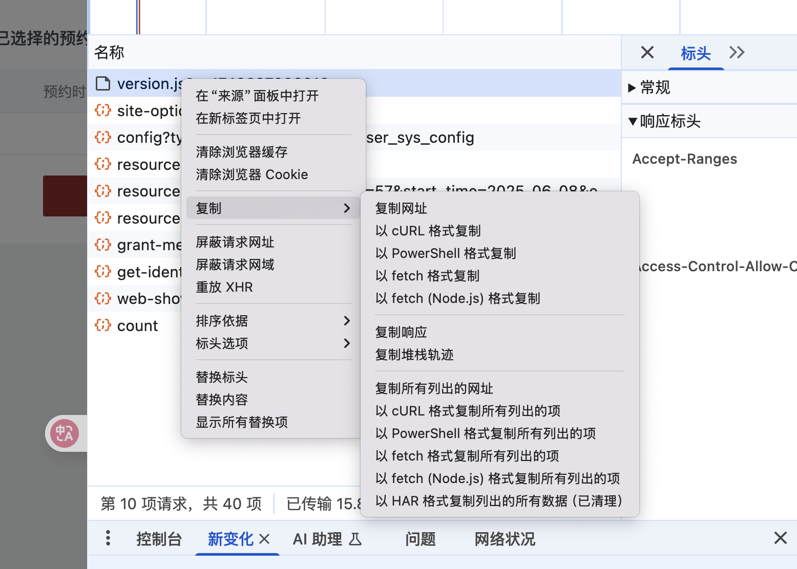

# 湖南大学体育馆预约脚本
* 注意，脚本虽快，但使用该脚本需要有一定计算机基础
* 直接抓请求的包，复制cURL(bash)
* 更新了两个羽毛球馆的id

# 未更新适配（可以自己试着改）ball.cpp——C语言多线程同时请求预约，最快的请求方式
# 推荐ball.py——python单线程，预约没有C快
# 使用说明
* 用浏览器登录一网通办，然后F12抓包


* 例如抓到的数据为
```
curl 'https://eportal.hnu.edu.cn/v2/static/version.js?v=1749397086013' \
  -H 'accept: application/json, text/javascript, */*; q=0.01' \
  -H 'accept-language: zh-CN,zh;q=0.9,en;q=0.8' \
  -H 'cache-control: no-cache' \
  -b 'UM_distinctid; PHPSESSID=ST-41911-4scez111c7wNouIS-zfsoftcom; vjuid=2811126; vjvd=3e159fb11111331876d931c1fa6da01; vt=26511194; cas_ticket=ST-41911161-4scezq111111uIS-zfsoft.com' \
  -H 'pragma: no-cache' \
  -H 'priority: u=0, i' \
  -H 'referer: https://eportal.hnu.edu.cn/v2/reserve/reserveDetail?id=57' \
  -H 'sec-ch-ua: "Google Chrome";v="137", "Chromium";v="137", "Not/A)Brand";v="24"' \
  -H 'sec-ch-ua-mobile: ?0' \
  -H 'sec-ch-ua-platform: "macOS"' \
  -H 'sec-fetch-dest: empty' \
  -H 'sec-fetch-mode: cors' \
  -H 'sec-fetch-site: same-origin' \
  -H 'user-agent: Mozilla/5.0 (Macintosh; Intel Mac OS X 10_15_7) AppleWebKit/537.36 (KHTML, like Gecko) Chrome/137.0.0.0 Safari/537.36' \
  -H 'x-requested-with: XMLHttpRequest'
```
# 修改.py文件
* header如果你登录不换浏览器不换设备只要改一次就行，每次运行只需要改cookie
* 根据你复制的curl来修改标头：
```
headers = {
        'accept': 'application/json, text/plain, */*',
        'accept-language': 'zh-CN,zh;q=0.9,en;q=0.8',
        'cache-control': 'no-cache',
        'content-type': 'application/x-www-form-urlencoded',
        'origin': 'https://eportal.hnu.edu.cn',
        'pragma': 'no-cache',
        'priority': 'u=1, i',
        'referer': 'https://eportal.hnu.edu.cn/v2/reserve/reserveDetail?id=83',
        'sec-ch-ua': '"Google Chrome";v="135", "Not-A.Brand";v="8", "Chromium";v="135"',
        'sec-ch-ua-mobile': '?0',
        'sec-ch-ua-platform': '"macOS"',
        'sec-fetch-dest': 'empty',
        'sec-fetch-mode': 'cors',
        'sec-fetch-site': 'same-origin',
        'user-agent': 'Mozilla/5.0 (Macintosh; Intel Mac OS X 10_15_7) AppleWebKit/537.36 (KHTML, like Gecko) Chrome/135.0.0.0 Safari/537.36',
        'x-requested-with': 'XMLHttpRequest',
}
```
* 重点注意这里的cookie
```
raw = """
//   -b 'UM_distinctid; PHPSESSID=ST-36472323-efZoJ7ReP0N232H-zfsoftcom; vjuid=2323; vjvd=3e159fbcc098c33132fa6da01; vt=264323832; cas_ticket=ST-3647798-efZoJ7R3233vKH-zfsoft.com' \
"""
```
* 开始预约时间默认为22:00:01(可修改)
```
hour,min,sec=22,0,1
```
* 调用方式如下，参数填写
* 24小时制时间段的起始时间，场馆0楼下1楼上，场号，抢连续的1/2个时间段     
```
get_time(13,1,1,1)
```


